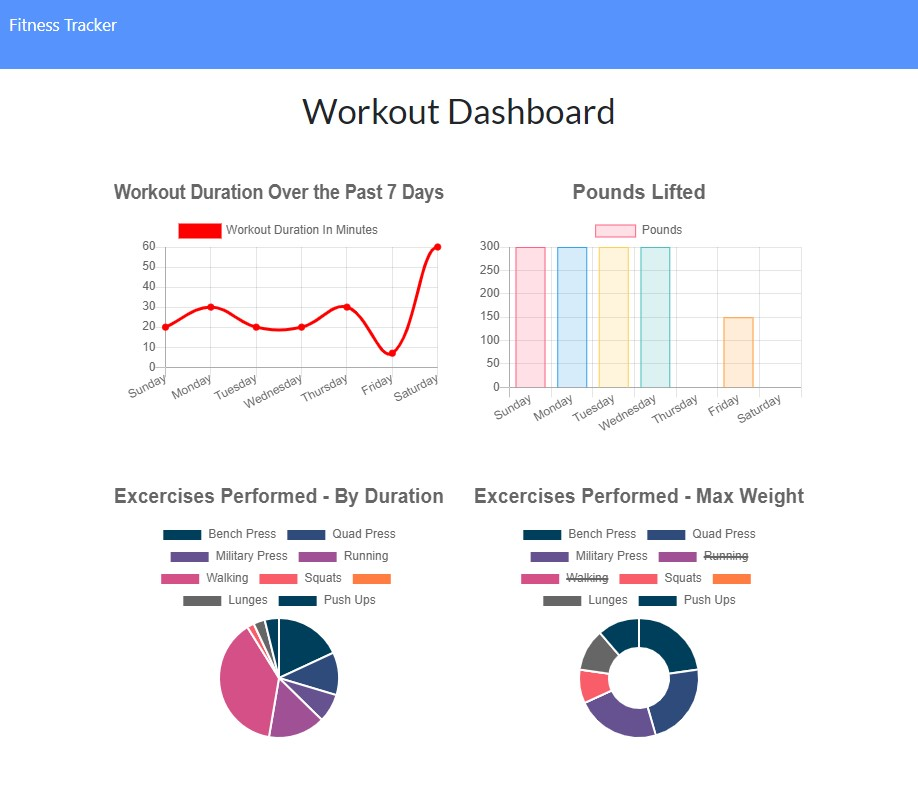

# The Fitness Witness
[](http://unlicense.org/)

## Description
Keep track of your workouts with the Fitness Witness!

Fitness Witness allows you to create workouts and add exercises to your workout using a NoSQL database to store your data.

Use the Dashboard for some data visualization of your workouts over the past seven days - 4 graphs showing:
- Workout duration
- Pounds lifted
- Toal duration of each exercise performed
- Max weight for each exercise performed

### Built With
- [Node.js](https://nodejs.org/)
- [Express](https://expressjs.com/)
- [Handlebars](https://handlebarsjs.com/)
- [MongoDB](https://www.mongodb.com/)
- [Mongoose](https://www.npmjs.com/package/mongoose)
- [ChartJs](https://www.chartjs.org/)
- [dotenv](https://www.npmjs.com/package/dotenv)
- [Nodemon](https://www.npmjs.com/package/nodemon)

[Link to Deployed Project](http://fitness-witness-1.herokuapp.com/)




## Table of Contents
1. [Installation](#installation)
2. [Usage](#usage)
3. [License](#license)
4. [Contributing](#contributing)
5. [Questions](#questions)
6. [Credits](#credits)


## Installation
To install the necessary dependencies, run:
```
npm install
```


## Usage
To use the app:
1) Choose whether you want to add a new workout or continue your current workout.
2) For eitehr option, you'll input the exercise type. If it is a cardio exercise, you'll input the name, distance, and duration. If it is a resistance exercise, you'll input the name, weight in pounds, number of sets, number of reps, and duration.
3) Add the exercise to your workout and then add more, or complete the workout.
4) When you complete the workout, you'll have the option again to continue to add more to the current workout or create a new one.
5) Click on the link to the Dashboard in the navbar to see a graphic display of your data from the past seven days.


## License
This project is licensed under the **unlicense** license.


## Contributing
Have an idea for an improvement? Is something not working properly? Please submit an issue on GitHub. If you see an issue that you'd like to work on, shoot me an email or just submit a pull request.


## Questions
If you have any questions about this project or repository, please open an issue or contact me at [molly.kizer@gmail.com](mailto:molly.kizer@gmail.com).

You can find more of my work at GitHub under my username [LivesInRoom29](https://github.com/LivesInRoom29).


## Credits
* Thanks to the UNH Bootcamp instructor, TAs, and my tutor for the great instruction, resources, and support.
* Thanks to my classmates for all their questions in class and for sharing their experiences in study groups.
* The front end for this app was provided by Trilogy education Services.
